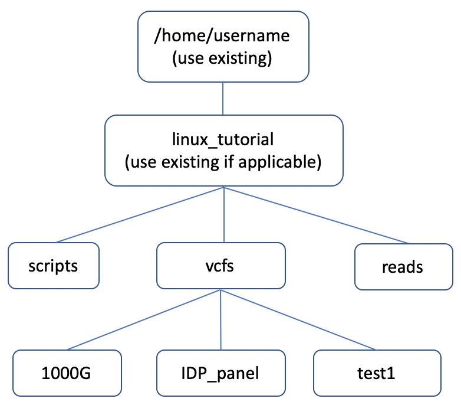

## Practical

### Task 1 — Instructions
1.  (a) Open a terminal in your computer. (b) What directory are you located in immediately after the terminal opens (also provide the command you used to check this)?
2.  Create the file/directory structure shown below (under your home directory) using the terminal and write the different commands used to achieve this. 
 
 

3.  (a) Download a VCF file of your choice (or one assigned to you) from the folder at https://github.com/twesigomwedavid/linux-and-R-intro/tree/main/data/vcfs and move it to the folder ``~/linux_tutorial/vcfs/test1/`` on your terminal. Write the command(s) you've used to achieve this.

    (b) Obtain the first 10 lines of the VCF file and save them in a new file (use file name of your choice). Write the command(s) you've used to achieve this.
    
    (c) State the total number of lines, and the number of variants in the VCF file? What commands/approach did you use to obtain this? 
    
    (d) Create a copy of the VCF file and give it a different (but reasonable) filename. Write the command(s) you've used to achieve this.
    
    
4.  (a) What command is used to remove a file in Linux? 

    (b) Provide at least 5 options that can be used with this command. What command did you use to obtain these options? 
   
   
5.  (a) What is the difference between the ``cat`` and ``less`` commands? 

### Task 1 — Bonus
1.   (a) Create a file comprising 5 gene names of your choice (one on each line) using the ``nano`` editor. (b) What shortcut can you use to search for a pattern when editing a file with nano? 

2.   Mention at least 5 file extensions that are commonly used in genomics. 

